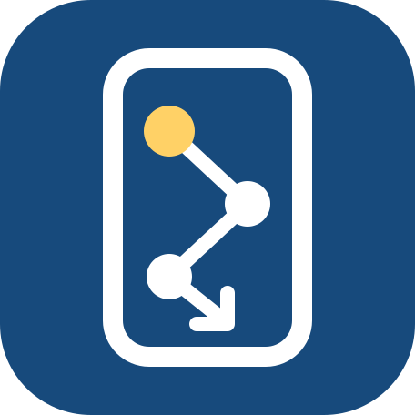
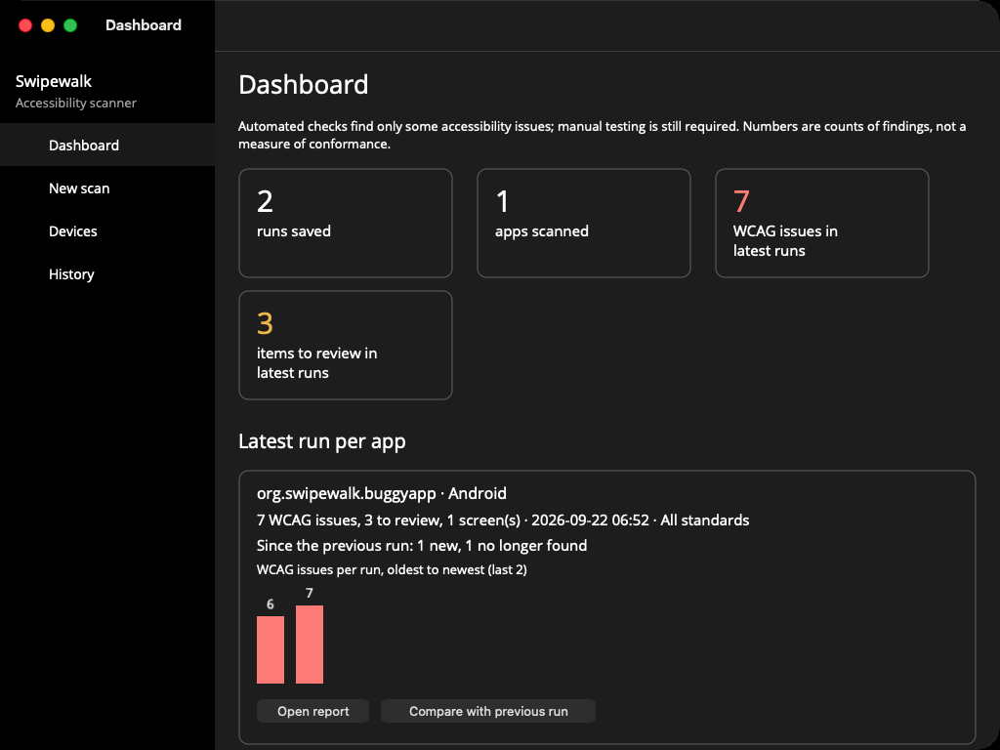
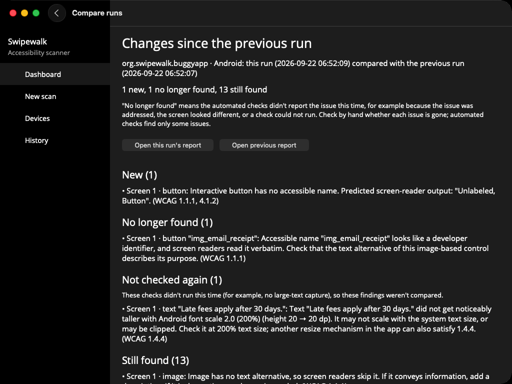

# Swipewalk

[](https://github.com/swipewalk/swipewalk/actions/workflows/ci.yml)
[](LICENSE)

Free, open-source accessibility scanner for **Android and iOS** apps (Windows planned), with first-class support for **.NET MAUI**.

Swipewalk inspects a **running app** through each platform's accessibility layer, applies a [shared set of rules](docs/checks.md), and maps every WCAG finding to **WCAG 2.2** success criteria. Platform-guideline advisories (Apple 44×44 pt, Android 48×48 dp touch targets) are reported separately and are not WCAG failures. Output is a machine-readable JSON file plus a human-readable HTML report with the screenshot, a predicted screen-reader transcript and contrast measured from the rendered pixels. On Android, `--screen-reader` also drives TalkBack itself and reports differences from the prediction for you to check (opt-in; costs extra time per element).


> **Status:** early development. Android (emulator or phone) and iOS (Simulator or iPhone) can be scanned one screen at a time, or recorded across screens while you use the app. See [known limitations](docs/limitations.md).

**New here?** The [user guide](docs/user-guide.md) walks through install, device setup, your first scan, reading a report and CI in about 10-15 minutes.

**Try it on the sample apps first:** [the case study](docs/case-study.md) shows what Swipewalk finds in a small .NET MAUI app with 11 planted accessibility bugs, in native Android (Views + Jetpack Compose) and iOS (UIKit + SwiftUI) apps with the same bug classes, and in four of Microsoft's .NET MAUI samples, on emulators, simulators and real phones — including a light/dark contrast comparison, Google's Accessibility Test Framework against Swipewalk's own rules, and what it misses.

## What it is — and isn't

Swipewalk produces **evidence**: automated findings with screenshots and the criteria they relate to.
It does **not** certify compliance. Automated checks catch only part of what WCAG requires; many criteria need manual testing by a person using assistive technology.
Its own rules cover missing accessible names, touch target size, identifier-like names, visible-text-in-name, text contrast, text resize, controls or text that disappear at large text sizes with no scrollable area to reach them (for review), whether Android screens expose a pane title, candidate personal-data input fields with no confirmed autofill/content-type hint, and icon contrast (iOS), plus the platform engines it wraps (Apple's accessibility audit on iOS, Google's Accessibility Test Framework on Android) — see [every check, what it looks for and its WCAG mapping](docs/checks.md). `scan --appearance both` also captures and checks the screen in the device's other dark/light appearance, so a contrast failure that only shows up in one theme isn't missed just because the device happened to be in the other one.
Every report lists the [known limitations](docs/limitations.md) that apply to the scanned platform and framework, with what to check by hand instead.
Every report also lists all 55 WCAG 2.2 A/AA success criteria, with what this scan's automated checks did for each one and how to check the rest by hand — see [the user guide](docs/user-guide.md#wcag-22-coverage).
Findings are labelled with the [laws and standards](docs/standards.md) whose WCAG version and level include them (ADA Title II, Section 508, EN 301 549 v3.2.1 and v4.1.1, UK public sector regulations). That is a mapping to help prioritise, not legal advice. Each report records the rule versions it was checked against and warns when a mapping was last reviewed more than a year earlier.

## Platform support

| Platform | How it reads the app | Status |
|---|---|---|
| Android | uiautomator dumps over adb (emulator or USB device), plus a small instrumentation harness (ships with Swipewalk, no build needed) that adds Google's Accessibility Test Framework checks | Single-screen scans and record mode |
| iOS | XCUITest harness + Apple accessibility audit | Single-screen scans and record mode on the Simulator and iPhones |
| Windows | UI Automation (axe-windows) | Planned |
| .NET MAUI source | XAML / C# analysis | Planned |

Scanning reads the operating system's accessibility layer, so it should work for any framework that exposes its UI there; so far only .NET MAUI and native Android/iOS apps have been tested. Fix examples are currently written for .NET MAUI and native Android/iOS.

> **Use a test device.** On a physical phone, the large-text check temporarily changes the phone's
> text size and restores it afterwards. If a run is interrupted, the next run or `swipewalk doctor`
> tries to restore it, and says how to change it back by hand if it can't. Avoid running the
> large-text check on a phone someone relies on every day.

## Install

The command-line tool needs the [.NET 10 SDK](https://dotnet.microsoft.com/download) and runs on macOS:

```bash
dotnet tool install -g Swipewalk
swipewalk --version
```

It scans apps on devices you connect; it doesn't include the platform tools. For Android, install the
[Android SDK platform-tools](https://developer.android.com/tools/releases/platform-tools) (`adb`) — the
harness that adds Google's Accessibility Test Framework ships prebuilt with Swipewalk, so nothing else
needs installing for it. For iOS, install Xcode; the small scanning harness ships with Swipewalk and is
built on the first iOS scan. Run `swipewalk doctor --platform android|ios` to check what's missing.

From a clone of this repository, use `dotnet run --project src/Swipewalk.Cli --` in place of `swipewalk`.

There is also a [Mac app](#desktop-app-macos) with the same checks and a window instead of a terminal.

## Usage

The simplest way: describe the run once in `swipewalk.json` (see [the example](samples/BuggyApp/swipewalk.json)) and run

```bash
swipewalk run                 # install (optional), check, scan, save to history
swipewalk history             # list saved runs
```

`run` exits with code 3 when `failOn` is `"wcag-issues"` and issues were found (for CI), and 2 when a target couldn't be scanned. Exit code 0 means only that the automated checks found no WCAG issues; manual testing is still required. Every run is saved to a local history (`~/Library/Application Support/Swipewalk/runs` on macOS) that the desktop app reads.

Or use the individual commands:

```bash
# Android: the screen currently shown on the connected emulator/device
swipewalk scan --platform android --out report

# iOS: an app running on the booted Simulator
swipewalk scan --platform ios --bundle-id com.example.app --out report

# Record mode: use the app; each new screen is scanned (also at a large text size). Press q to finish.
swipewalk record --platform android --expect "Login,Home,Settings" --out report
swipewalk record --platform ios --bundle-id com.example.app --out report
```

If a recording ends early (an error, a cancellation, a disconnect, or Swipewalk itself being closed or crashing), it's still saved to History with what it captured; `swipewalk record --continue <run>` resumes it, appending screens to the same run — see the [user guide](docs/user-guide.md#5-record-mode-and-the-large-text-check).

Physical devices: Android phones work over USB (enable USB debugging; tested on a Pixel 4a with Android 13), and physical iPhones work with `scan` and `record` (tested on iOS 18.6 and 27.0), signing a small scanning harness automatically — never the app being scanned. `swipewalk devices` lists what is connected and `swipewalk doctor --platform android|ios` checks a device and app are ready, with fix instructions for whatever isn't. See the [user guide](docs/user-guide.md#2-set-up-a-device) for pairing, signing options (`--team`, `--profile`, `--harness-bundle-prefix`) and the Face ID/passcode prompt. On a physical phone, the large-text check (record mode and `scan --large-text`) changes the device's text size and restores it afterwards, so use a test device where you can: on Android this is quick, and on a physical iPhone Swipewalk drives the Settings app itself (Larger Accessibility Sizes, Larger Text to AX3), which takes a couple of minutes per screen and needs the phone to stay unlocked; see the [user guide](docs/user-guide.md#5-record-mode-and-the-large-text-check) for details and the fallback when that isn't possible.

Swipewalk never needs an app's source code and never rebuilds or re-signs it: any installed app can be scanned, debug or production, whoever signed it. `--install <file>` installs a build first: an Android `.apk`, an iOS Simulator `.app`, or a device `.ipa` signed for that device (iOS cannot install an `.ipa` signed for other devices; install those through TestFlight, the App Store or MDM and scan by `--bundle-id`). See the [limitations](docs/limitations.md) for apps that block screenshots or automation.

Add `--standard ada-title-ii` (or `section-508`, `en-301-549`, `en-301-549-v4`, `uk-public-sector`) to focus the report's headline on one standard.

Output: `report/report.html` and `report/results.json`.

## Desktop app (macOS)

The desktop app does the same scans with a window instead of a terminal: check devices, start a scan or recording, read the report, and see what changed since the previous run.





<details>
<summary>Watch a 13-second tour of the app (animated, plays once)</summary>


</details>

Download `Swipewalk-<version>.dmg` from the [releases page](https://github.com/swipewalk/swipewalk/releases)
and drag it to Applications. It is signed and notarized with a Developer ID, so macOS doesn't block it as
coming from an unidentified developer; the first launch still asks you to confirm, as it does for anything
downloaded. It needs macOS 12 or later, runs on both Apple silicon and Intel, and uses the same platform
tools as the command-line tool.

To build it from source instead (needs the .NET 10 SDK, the MAUI workload and Xcode):

```bash
dotnet workload install maui
dotnet build src/Swipewalk.Desktop -f net10.0-maccatalyst -c Release
open src/Swipewalk.Desktop/bin/Release/net10.0-maccatalyst/Swipewalk.app
```

A Windows version will follow the Windows collector.

The app's own accessibility, what we test and the known issues, are described in its [accessibility statement](docs/accessibility-statement.md).

## Repository layout

```
src/Swipewalk.Core        Accessibility-tree model, rules, WCAG mapping, reports, limitations
src/Swipewalk.Collectors  Android (adb/uiautomator) and iOS (XCUITest harness) collectors
src/Swipewalk.Engine      Scan workflow shared by the CLI and the desktop app: install, checks, scan, record, run, history
src/Swipewalk.Cli         `swipewalk` command-line tool (a thin layer over the Engine)
harness/ios                  Thin XCUITest harness used by the iOS collector
harness/desktop-uitests      UI tests for the desktop app (run with scripts/desktop-uitests.sh)
src/Swipewalk.Desktop     .NET MAUI desktop app (Mac Catalyst; Windows later)
samples/BuggyApp             .NET MAUI app with deliberate accessibility bugs (ground truth)
samples/NativeAndroid        Native Android app (Views + Jetpack Compose), same bug classes, no MAUI
samples/NativeiOS            Native iOS app (UIKit + SwiftUI), same bug classes, no MAUI
docs/                        Known limitations and standards mapping (generated)
tests/                       Unit and acceptance tests
```

## Building

Requires the .NET 10 SDK.

```bash
dotnet build
dotnet test
```

## Roadmap

What works now, and the broad areas we're working towards: see [ROADMAP.md](ROADMAP.md).

## Contributing

Wrong findings, missed issues and wrong WCAG mappings are the most useful reports. See [CONTRIBUTING.md](CONTRIBUTING.md); security problems go to [SECURITY.md](SECURITY.md).

## License and terms

Free to use, including commercially, under the [Apache License 2.0](LICENSE). See the [disclaimer and terms of use](DISCLAIMER.md) (what results mean, scanning only apps you may test), [privacy](PRIVACY.md) (no telemetry; Swipewalk makes no network requests of its own) and [third-party notices](THIRD-PARTY-NOTICES.md).

The sample apps belong to the fictional "City of Exampleville".
