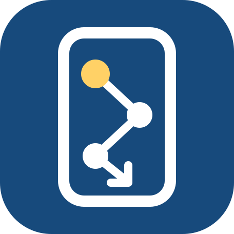
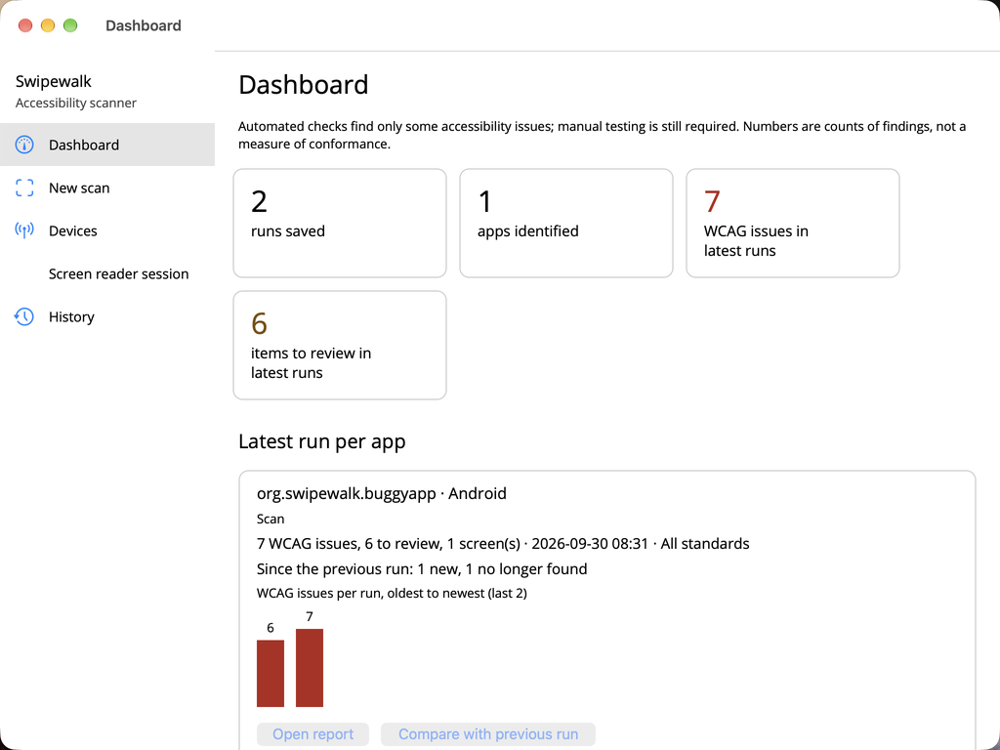

# Swipewalk

Free accessibility scanner for **Android and iOS** apps (Windows planned), with first-class support for **.NET MAUI**.

Swipewalk inspects a **running app** through each platform's accessibility layer, applies a [shared set of rules](docs/checks.md), and maps every WCAG finding to **WCAG 2.2** success criteria. Platform-guideline advisories (Apple's default control size of 44×44 pt and stated minimum of 28×28 pt, Android's 48×48 dp touch targets) are reported separately and are not WCAG failures. Output is a machine-readable JSON file plus a human-readable HTML report with the screenshot, a predicted screen-reader transcript and contrast measured from the rendered pixels.


> **Status:** early development. Android (emulator or phone) and iOS (Simulator or iPhone) can be scanned one screen at a time, or recorded across screens while you use the app. See [known limitations](docs/limitations.md).

**New here?** The [user guide](docs/user-guide.md) walks through install, device setup, your first scan, reading a report and CI in about 10-15 minutes. The [case study](docs/case-study.md) shows what Swipewalk finds in sample apps, on emulators, simulators and real phones, and what it misses.

## What it is — and isn't

Swipewalk produces **evidence**: automated findings with screenshots and the criteria they relate to.
It does **not** certify compliance. Automated checks catch only part of what WCAG requires; many criteria need manual testing by a person using assistive technology.

- No overlays: Swipewalk adds nothing to your app and doesn't claim to fix it at runtime.
- No certification or legal advice: laws and standards are shown for reference only.
- No automatic code changes: every fix is left to the developer to make and review.
- Not a replacement for testing with disabled people.

## What it checks and what you get

- **Checks:** Swipewalk's own rules, plus Apple's accessibility audit on iOS and Google's Accessibility Test Framework on Android. See [every check and its WCAG mapping](docs/checks.md).
- **Optional rescans:** at a large text size (`--large-text`; on by default in record mode), in the other dark or light appearance (`--appearance both`) and in the other orientation (`--orientation both`), to help find problems that show up in only one setting.
- **Record mode:** you move through the app and scan the screens you choose.
- **Screen reader evidence (`--screen-reader`; off by default on the command line, on by default for Android in the desktop app):** TalkBack on Android and Xcode's Accessibility Inspector on iOS, with differences from the predicted announcement listed for you to check by hand.
- **Reports:** a "What to fix" view for developers and a "Full audit detail" view with the full WCAG 2.2 coverage table. Findings say who is affected, and findings that look like the same cause are grouped. Findings can be marked as triaged by your team.
- **Exports:** Markdown tickets, CSV, a single HTML file, a tagged PDF and a draft accessibility conformance report for a person to review.
- **Laws and standards:** each issue lists the laws and standards it is relevant to, for reference only and not legal advice. See [laws and standards](docs/standards.md).
- **App source (optional, `--source`):** points a finding at a likely source line in a project folder on your computer. The folder is read locally and never uploaded.

Automated checks find only part of what WCAG asks for; manual testing is still required. The [user guide](docs/user-guide.md) describes each option.

## Platform support

| Platform | How it reads the app | Status |
|---|---|---|
| Android | uiautomator dumps over adb (emulator or USB device), plus a small instrumentation harness (ships with Swipewalk, no build needed) that adds Google's Accessibility Test Framework checks | Single-screen scans and record mode |
| iOS | XCUITest harness + Apple accessibility audit | Single-screen scans and record mode on the Simulator and iPhones |
| Windows | UI Automation (axe-windows) | Planned |

Scanning reads the operating system's accessibility layer, so it should work for any framework that exposes its UI there; so far only .NET MAUI and native Android/iOS apps have been tested. See [known limitations](docs/limitations.md).

> **Use a test device.** On a physical phone, several checks temporarily change device settings and
> restore them afterwards (text size, dark/light appearance, screen rotation, and TalkBack on Android).
> If a run is interrupted, the next run or `swipewalk doctor` restores what it can. Avoid running these
> checks on a phone someone relies on every day. Details: [user guide](docs/user-guide.md).

## Install

Releases up to 0.4.1 are under the Apache License 2.0; the Swipewalk License applies from 0.4.2 (see [License and terms](#license-and-terms)).

### Command line

The command-line tool needs the [.NET 10 SDK](https://dotnet.microsoft.com/download) and runs on macOS, Windows and Linux; what you can scan depends on your computer:

| Your computer | Apps you can scan |
|---|---|
| macOS | iOS and Android |
| Windows | Android (Windows apps: planned, not yet available) |
| Linux | Android |

```bash
dotnet tool install -g Swipewalk
swipewalk --version
```

It scans apps on devices you connect; it doesn't include the platform tools. For Android, install the [Android SDK platform-tools](https://developer.android.com/tools/releases/platform-tools) (`adb`). For iOS (macOS only), install Xcode. Run `swipewalk doctor --platform android|ios` to check what's missing.

```bash
swipewalk scan --platform android --out report                          # screen now shown on the device
swipewalk scan --platform ios --bundle-id com.example.app --out report  # app on the booted Simulator
swipewalk record --platform android --out report                        # use the app; press Enter to scan each screen you choose
```

Output: `report/report.html` and `report/results.json`. Every command and option is in the [user guide](docs/user-guide.md); a run can also be described once in [`swipewalk.json`](samples/BuggyApp/swipewalk.json) and started with `swipewalk run`.

## Desktop app (macOS)

The Mac app does the same scans with a window instead of a terminal: check devices, start a scan or recording, read the report, compare runs, mark findings as already looked at, and export tickets, a CSV, a shareable report, a tagged PDF or a draft Accessibility Conformance Report.



Download `Swipewalk-<version>.dmg` from the [releases page](https://github.com/swipewalk/swipewalk/releases) and drag it to Applications. It is signed and notarized with a Developer ID; the first launch still asks you to confirm, as it does for anything downloaded. It needs macOS 12 or later, runs on Apple silicon and Intel, and uses the same platform tools as the command-line tool. The app's own accessibility, what we test and the known issues are in its [accessibility statement](docs/accessibility-statement.md).

## Help and feedback

Wrong findings, missed issues and wrong WCAG or law mappings are the most useful reports: [open an issue](https://github.com/swipewalk/swipewalk/issues/new/choose). Security problems go to [SECURITY.md](SECURITY.md). See also [SUPPORT.md](SUPPORT.md) and the [roadmap](ROADMAP.md).

## License and terms

Free to use, including commercially, under the [Swipewalk License](LICENSE): you may use it for any purpose the licence allows, including paid work testing your clients' apps, and give others unmodified copies free of charge, but not sell it, offer it to others as a hosted or online service, share modified copies or reverse engineer it. It is not open source: the source code of the app and the command-line tool is not public (a few small helper parts ship as source because they are built or run on your computer). Versions 0.1.0 to 0.4.1 were released under the Apache License 2.0; anyone who has a copy of those versions keeps the rights that licence gave them. See the [disclaimer and terms of use](DISCLAIMER.md) (what results mean, scanning only apps you may test), [privacy](PRIVACY.md) (no telemetry; Swipewalk makes no network requests of its own) and [third-party notices](THIRD-PARTY-NOTICES.md).

The sample apps belong to the fictional "City of Exampleville".
