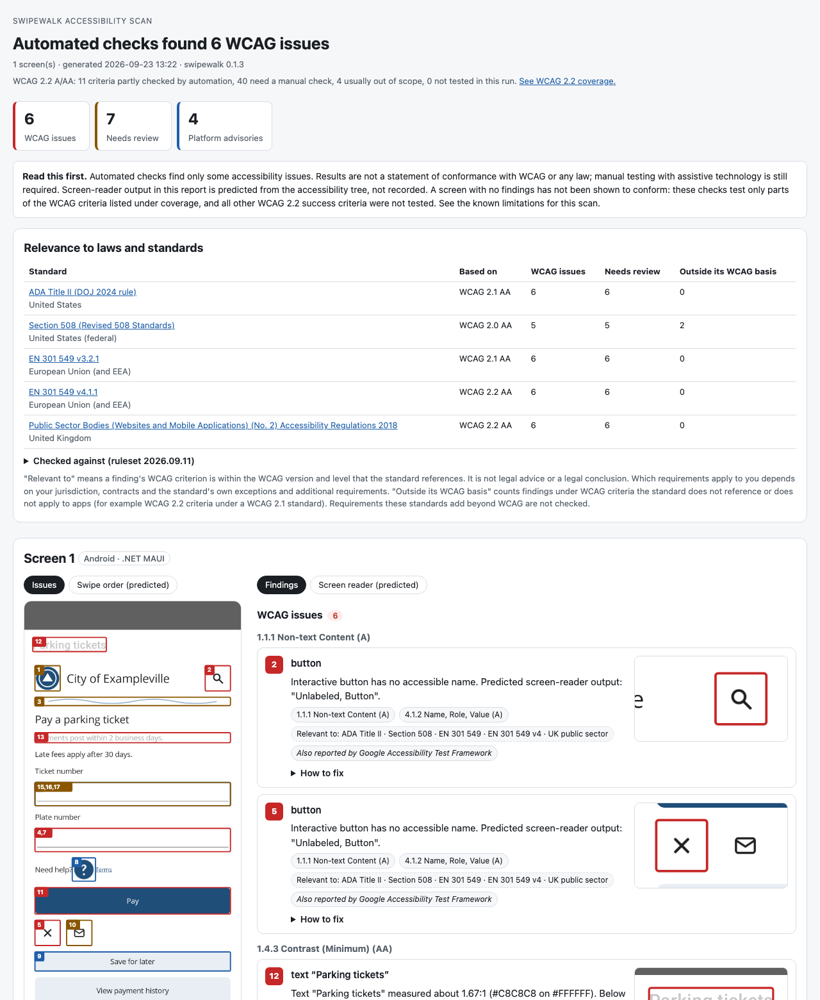

# Case study: what Swipewalk finds, and what it misses

Seven studies. The first scans a sample app with known bugs, so the results can be checked against an
answer key. The second scans real apps: Microsoft's official .NET MAUI samples, on emulators,
simulators and physical phones. The third looks at one more of those samples in detail, comparing a
light-mode and a dark-mode scan of the same screen and comparing Google's Accessibility Test Framework
against Swipewalk's own rules. The fourth applies the same approach to Swipewalk's own desktop app.
The fifth plants the same known bugs from the first study into native (no .NET MAUI) Android and iOS
apps, one screen per UI toolkit (Views, Jetpack Compose, UIKit, SwiftUI), to see how the same mistake
shows up -- or doesn't -- depending on the toolkit. The sixth drives TalkBack itself, in five
languages, to check what a real capture finds beyond a predicted transcript. The seventh does the
same for iOS with Xcode's Accessibility Inspector, on a physical iPhone, across a MAUI app and a
native one.

None of these studies is a statement of conformance. Automated checks find only some accessibility issues,
and manual testing with assistive technology is still required.

## 1. BuggyApp: a sample .NET MAUI app with planted bugs

[`samples/BuggyApp`](../samples/BuggyApp) is a one-screen "Pay a parking ticket" app for the
fictional City of Exampleville, written the way many real MAUI apps are. It has 11 planted
accessibility bugs (B1–B11) and some correctly built controls for comparison. The answer key is
[`ground-truth.json`](../samples/BuggyApp/ground-truth.json), and an acceptance test
(`GroundTruthTests`) fails if a scan of the saved Android and iOS captures finds anything more or less
than it lists. The only saved large-text capture is the Android one, so the iOS large-text expectations
in the answer key are written down for reference but not yet enforced by a test. The [README](../README.md)'s
screenshot of this app on iOS is rendered from the saved iOS capture at normal text size only, so it
shows one fewer needs-review item (4) than the "iOS Simulator" column below (5), which also includes
the AX3 large-text rescan; B11 (see the table below) is the difference.

Scanned on 2026-09-22 on an Android 16 emulator and an iPhone 17 Simulator (iOS 26.5), with the
same app build (.NET MAUI 10.0.110, pinned in the project), using `scan --large-text` (a second
capture at Android 200% / iOS AX3 text size). The Android numbers below were re-verified on
2026-09-23, combining that saved capture with Google's Accessibility Test Framework results from a
live emulator rescan that same day, since ATF now runs by default on Android scans (falling back to
today's checks alone if it can't install or run; ruleset 2026.09.11 — see "Found without being
planted" and "False positives" below for what ATF added); the iOS numbers are unchanged. The finding
counts and coverage lines below were then updated again (ruleset 2026.09.12, three new rules —
page-titled, input-purpose, icon-contrast) by recomputing from those same saved captures against the
new ruleset, not a fresh device rescan; the screenshots below are from the 2026-09-23 rescan and don't
show the coverage line, so they're unaffected.

| | Android | iOS Simulator |
|---|---|---|
| WCAG issues | 6 | 6 |
| Needs review | 8 | 5 |
| Platform advisories | 4 | 2 |

Both reports also say what was **not** checked, and the two now differ because Google's Accessibility
Test Framework only runs on Android: Android's coverage line reads "WCAG 2.2 A/AA: 13 criteria partly
checked by automation, 37 need a manual check, 4 usually out of scope, 1 not tested in this run"; a
current iOS report reads "10 criteria partly checked by automation, 37 need a manual check, 4 usually out of scope, 4
not tested in this run" -- for the four criteria where Google's Accessibility Test Framework or the new
Android-only page-titled check is the only automated check on that criterion (1.3.2 Meaningful
Sequence, 2.4.2 Page Titled, 2.4.3 Focus Order, 2.4.4 Link Purpose (In Context)), that check runs on
Android only, so on iOS they're counted as not tested in this run rather than folded into "need a
manual check". 1.4.11 Non-text Contrast moved out of that iOS gap list with this update: the new
icon-contrast rule now also covers it on iOS directly (see section 3 below), even though it found
nothing to flag on this screen. 1.4.10 Reflow moved from "need a manual check" to "partly checked by
automation" with the addition of the offscreen-unreachable rule, but that rule runs on iOS only (see
[docs/limitations.md](limitations.md): Android's own accessibility dump clips a node's reported bounds
to the visible screen, so it has nothing to measure off-screen content with) -- Reflow is the one
PartlyAutomated criterion that is "not tested in this run" on the Android side of this table, and
"partly checked by automation" (with nothing to flag on this screen, whose bottom-most controls fit
inside the iOS Simulator capture's bounds) on the iOS side. Not one of the 55 criteria is fully covered by
automation on either platform.

offscreen-unreachable's target bug was first noticed by eye on a physical iPhone SE: BuggyApp's
first screen doesn't fit at normal/100% text size on that small a device, and the page has no
ScrollView. Confirmed automatically on an iPhone SE (3rd generation) Simulator (375×667 pt, 2026-09-25):
"View payment history" (678-728 on the 667-pt screen) was flagged as off-screen; "Save for later"
(ending at 666, one point inside the bottom edge) correctly was not. Confirmed again the same way on a
physical iPhone SE (375×667 pt, iOS 27.0): the same finding, naming "View payment history" once, matching
what was seen by eye. Neither of those two capture sizes is what the numbers above are from --
those are still from the larger, 402×874 pt iPhone 17 Simulator capture, where this screen fits and
offscreen-unreachable finds nothing.



### Planted bugs

| Bug | Android | iOS |
|---|---|---|
| B1 City seal image with no text alternative | Needs review (1.1.1) | Needs review (1.1.1) |
| B2 Icon-only search button with no name | WCAG issue (1.1.1, 4.1.2) | WCAG issue (1.1.1, 4.1.2) |
| B3 Helper text at 2.3:1 contrast | WCAG issue (1.4.3), measured from pixels | WCAG issue (1.4.3), measured from pixels |
| B4 Entry whose visible label isn't linked to it | WCAG issue (4.1.2), plus target-size advisory | WCAG issue (4.1.2) |
| B5 20×20 help icon | Platform advisory (44 dp is below Android's 48 dp) | Not reported: MAUI enlarges the touch area to 44 pt, the size in Apple's guideline |
| B6 Button shows "Pay", but its name is "Submit" | WCAG issue (2.5.3) | WCAG issue (2.5.3) |
| B7 Close button with only an AutomationId | WCAG issue (1.1.1, 4.1.2) | WCAG issue (1.1.1, 4.1.2) |
| B8 Email button named "img_email_receipt" | Needs review (1.1.1): the name looks like code, but only a person can judge whether it describes the button | Needs review (1.1.1) |
| B9 36-tall "Save for later" button | Platform advisory | Platform advisory |
| B10 Tiny "Terms" tap link | **Missed**: MAUI doesn't mark tap-gesture labels as clickable, so Android doesn't expose it as a target | Platform advisory (not reported under 2.5.8: the spacing exception applies) |
| B11 Fixed-height text that clips when text is enlarged | Needs review (1.4.4), found in the 200% text-size rescan | Needs review (1.4.4), found in the AX3 text-size rescan |

On Android, 10 of the 11 planted bugs were reported; on iOS, 10 of 11 (B5 is not a problem there).
B10 is the only miss. B11 is found only by the large-text rescan (record mode or `scan --large-text`).

B11 also shows how much the app's framework version changes what a scan can see. On iOS, with the MAUI
version BuggyApp used before this pin (older than 10.0.100), almost no text on this screen grew while
the app was running, so one screen-wide finding covered everything and B11 couldn't be singled out
there. On 10.0.110, which includes the fix described in section 2, the rest of the text grows and B11
stands out as its own finding, naming the text and its measured height. Android already reported it
that way, because the fix is an iOS one. The bug never changed; the scanner's view of it did.

### Found without being planted

- **Low-contrast page title from the default MAUI template styles** (light gray on white, about
  1.7:1): a WCAG 1.4.3 issue on both platforms that nobody planted. It comes from the project
  template, so many MAUI apps probably have it.
- **No Android pane title exposed to screen readers** (WCAG 2.4.2, Android only, needs review): the
  page-titled rule added in ruleset 2026.09.12. MainPage sets a MAUI `Page.Title` ("Parking tickets"),
  shown in its `NavigationPage` toolbar, and has two headings -- but MAUI does not set an Android
  accessibility pane title from `Page.Title`, so nothing is exposed there either way. This rule can't
  tell whether TalkBack still announces a title from the window title instead (which it doesn't read);
  see [known limitations](limitations.md) "android-page-title" for that gap, and the open question of
  how often this fires across a whole app's screens, which this one-screen study can't answer.
- **Fixed font sizes don't follow the iOS text size setting** (Dynamic Type): reported by Apple's
  accessibility audit, which Swipewalk runs and merges with its own findings.
- **The ticket-number entry renders 44 dp tall on Android**: a platform advisory (Android's guideline
  is 48 dp; it is above the 24×24 WCAG minimum, so it is not reported as a WCAG issue).
- **Google's Accessibility Test Framework, wrapped on Android, adds three more items for review on
  this screen** that Swipewalk's own rules don't cover: `EditableContentDescCheck` on the "Ticket
  number" field (4.1.2 Name, Role, Value) — the content description that fixed the field's name,
  described below, can also stop TalkBack announcing what was actually typed into the field, so it
  needs a check — and `ImageContrastCheck` on the decorative divider and `DuplicateSpeakableTextCheck`
  on the same field, both described next.

### False positives, past and present

- **A decorative divider that is correctly hidden** is reported for review like B1. Neither
  uiautomator nor XCUITest shows the "hidden on purpose" flag, so the scanner can't tell it apart
  from an image that is missing its text alternative. It is reported as "needs review", not as a
  WCAG issue, for this reason. Google's Accessibility Test Framework also flags the same divider, for
  a different reason: an estimated 2.09:1 contrast against its background (1.4.11 Non-text Contrast,
  which exempts purely decorative graphics) — once a person confirms it's decorative, there is no
  1.4.11 problem here either.
- **The "Ticket number" field's missing name used to be flagged for review on Android, and no longer
  is.** Until .NET MAUI 10.0.110, that field's description didn't reach Android's accessibility tree
  as a name (dotnet/maui#37151), and its text appeared only where a typed value would, so Swipewalk
  couldn't tell whether TalkBack would announce it and asked for a check. With the framework fix the
  name is there and that finding is gone. The same doubt still applies to Android text fields that
  have no explicit description, which is why Swipewalk reports those for review rather than as
  failures. The field is flagged for review again since Google's Accessibility Test Framework started
  running, but for the different reasons above, not this one — `DuplicateSpeakableTextCheck` (no WCAG
  criterion is mapped for this check) also flags it, which looks like noise: the field's spoken text
  matches the visible label above it, which is what a label is for.

### What this study doesn't show

- It covers one screen with bugs we chose; real apps will have issues these rules don't check. See
  [known limitations](limitations.md).
- The input-purpose rule (WCAG 1.3.5, ruleset 2026.09.12) correctly finds nothing on this screen: its
  two text fields are "Ticket number" and (unlabeled) "Plate number", neither of which matches its
  personal-data keyword list. The icon-contrast rule (WCAG 1.4.11, iOS) also finds nothing on this
  screen's icon-only buttons. Real-device scans (Pixel 4a, iOS Simulator, and a physical iPhone running
  a different sample app) confirmed both stay quiet rather than false-flagging, but neither has yet
  shown a true positive outside its own unit tests -- this study doesn't demonstrate what either looks
  like when it does fire.
- Screen-reader output in the reports is **predicted** from the accessibility tree, not recorded
  from TalkBack or VoiceOver.
- Keyboard access, focus order and meaningful sequence, status messages, and most other WCAG
  criteria still need manual testing.

### Run it yourself

Android emulator (start BuggyApp after installing it):

```bash
dotnet build samples/BuggyApp -t:Install -f net10.0-android
dotnet run --project src/Swipewalk.Cli -- scan --platform android --large-text --out report
```

iOS Simulator (boot a Simulator first):

```bash
dotnet build samples/BuggyApp -f net10.0-ios -p:RuntimeIdentifier=iossimulator-arm64
xcrun simctl install booted samples/BuggyApp/bin/Debug/net10.0-ios/iossimulator-arm64/BuggyApp.app
dotnet run --project src/Swipewalk.Cli -- scan --platform ios --bundle-id org.swipewalk.buggyapp --large-text --out report
```

Both need the .NET 10 SDK with the MAUI workload (`dotnet workload install maui`); iOS also needs
Xcode, and Android the Android SDK.

## 2. Real apps: Microsoft's .NET MAUI samples

The sample app above was written to be tested. To see what Swipewalk reports on apps it wasn't
written for, we scanned three of Microsoft's official .NET MAUI sample apps from
[`dotnet/maui-samples`](https://github.com/dotnet/maui-samples) (MIT license):

- **DeveloperBalance**: the sample app that `dotnet new maui --sample-content` produces;
- **TipCalc**: a small form with text fields and a slider;
- **Calculator**: a grid of buttons.

These results describe these sample versions, on these devices, with this Swipewalk version. Apps,
MAUI, the operating systems and Swipewalk all change, so results on other versions will differ.

### Versions tested

| | |
|---|---|
| Samples | `dotnet/maui-samples` commit `e78b475` (2026-08-11), `10.0/Apps` |
| .NET | SDK 10.0.300, workload set 10.0.300.3 (MAUI workload 10.0.20/10.0.100) |
| .NET MAUI | `Microsoft.Maui.Controls` 10.0.60 (all three apps) |
| Xcode | 27.0 (the .NET for iOS pack 26.5.10284 expects Xcode 26.5; see below) |
| Swipewalk | 0.1.0, ruleset 2026.09.8 |
| Android emulator | Android 16 (API 36), `sdk_gphone16k_arm64` image, light mode |
| Android phone | Google Pixel 4a, Android 13 (API 33), dark mode |
| iOS Simulator | iPhone 17, iOS 26.5 |
| iPhone | iPhone SE, iOS 27.0 |

Scanned on 2026-09-22. On the Android emulator we scanned 9 screens (6 in DeveloperBalance, TipCalc
empty and with an amount entered, Calculator). On the other three devices we scanned each app's first
screen: the study script could drive the Android emulator, but not iOS apps and not the physical
phones. (Record mode lets a person navigate and scan further screens on any device.)

These samples use `Microsoft.Maui.Controls` 10.0.60, which is **before** the fix for live text-size
changes on iOS described below (shipped in 10.0.100). We kept them on that version deliberately: it is
what `dotnet new maui` produced for this samples commit, and it shows what a scan reports for the many
apps still on an older MAUI. Our own sample app, BuggyApp in section 1, runs the current 10.0.110.

### What we had to change to run them

- **iOS builds** used `-p:ValidateXcodeVersion=false`, because the installed .NET for iOS pack asks
  for Xcode 26.5 and this Mac has Xcode 27.0.
- **On the iPhone** the apps were installed under our own bundle IDs (`org.swipewalk.study.*`) to sign
  them for the device.
- **On iOS 27 the unmodified samples crash at launch.** iOS 27 stops apps that haven't adopted the
  UIScene lifecycle, and these samples haven't. To scan them we added MAUI's scene support to each app
  (a `UIApplicationSceneManifest` entry in `Info.plist` and a `SceneDelegate` class derived from
  `MauiUISceneDelegate`). The iOS 26.5 Simulator runs the unmodified apps. If your MAUI app targets
  iPhones, check this before your users update to iOS 27.

### Results on each app's first screen

WCAG issues / needs review / platform advisories:

| App | Android emulator | Pixel 4a | iOS Simulator | iPhone SE |
|---|---|---|---|---|
| TipCalc | 1 / 1 / 4 | 1 / 3 / 4 | 2 / 3 / 2 | 2 / 3 / 2 |
| Calculator | 0 / 1 / 0 | 0 / 1 / 0 | 0 / 2 / 1 | 0 / 2 / 14 |
| DeveloperBalance | 0 / 2 / 2 | 0 / 2 / 2 | 0 / 1 / 2 | 0 / 1 / 2 |

The other five DeveloperBalance screens on the emulator had no WCAG issues. They had 0 to 9 items for
review each, mostly text fields (see "Doubtful or unclear results"), and up to 31 platform advisories.

Calculator's 14 advisories on the iPhone are the clearest example of why we separate WCAG failures from
platform guidelines. Thirteen of them are one per button: at iOS's AX3 text size, about 235%, the digits
grow inside fixed-size buttons until they overlap ("C" goes from 44 to 96 points tall). WCAG 1.4.4 asks
for 200%, and this only appears above that, so it is reported as an advisory citing Apple's Dynamic Type
guidance, not as a WCAG issue. The fourteenth is the restart advisory described below. The same app on
the iPhone 17 Simulator grows exactly the same way and reports none of those overlaps, because its
button rows are 105 points tall against the iPhone SE's 86. Two devices, the same app and the same
rules, different results: screen size decides whether enlarged text collides.

### What it found

- **An unnamed slider** in TipCalc: a WCAG issue (1.1.1, 4.1.2) on all four devices. A screen reader
  reaches it but has no name to announce. It cites 1.1.1 as well as 4.1.2 because a slider is a control
  whose only label is its own accessible name; an unnamed text field cites 4.1.2 alone, since its
  visible label may still be read as adjacent text.
- **A text field with no name** in TipCalc ("Tip Percent", which starts at 15). Its visible label
  isn't connected to the field. On iOS this is a WCAG issue (4.1.2), because iOS reports the value and
  the placeholder separately. On Android it is flagged for review: the Android accessibility tree
  doesn't show whether a field's text is a typed value or a placeholder.
- **Low-contrast tags** in DeveloperBalance, flagged for review, measured from screenshot pixels.
  On the emulator (light mode) the "work" tag measured about 4.49:1 and "personal" about 3.07:1. On
  the Pixel 4a, which was in dark mode, the app switched to its dark theme and the "work" tag measured
  about 3.52:1. These values are below 4.5:1, which normal-size text needs, but above 3:1, which is
  enough for large text, so they need a person to judge the text size.
- **Text that only changes size after the app restarts**, on both iOS devices, in all three apps. The
  rescan set the system text size, saw nothing change, restarted the app and saw the text grow. That is
  reported as a platform advisory citing Apple's Dynamic Type guidance, not as a WCAG issue: 1.4.4 asks
  that text can be resized, not that it happen without a restart. Still, somebody who enlarges the text
  while using the app sees the old size until they restart it. This is a known .NET MAUI issue on iOS,
  fixed in `Microsoft.Maui.Controls` 10.0.100 (dotnet/maui#34445); these samples predate it. On the
  Simulator, where Swipewalk can read the app's MAUI version, the finding names it: "This app uses .NET
  MAUI 10.0.60."
- **Text that doesn't grow at all**, flagged for review under 1.4.4: Calculator's display digit on both
  Android and iOS keeps its height at any text size, and on the Pixel 4a DeveloperBalance's "Tasks"
  label went the other way, from 29 dp to 3 dp. Apple's accessibility audit separately reported
  unsupported Dynamic Type fonts in all three apps on both iOS devices (10 elements in TipCalc, 21 in
  Calculator, 20 in DeveloperBalance).
- **Touch targets smaller than Android's 48×48 dp guideline**, many of them in DeveloperBalance's
  pickers and lists. These are platform advisories, not WCAG failures.

### What the reports say they didn't check

Every report lists all 55 WCAG 2.2 Level A and AA criteria with what this scan did about each one. For
most of these screens, 7 criteria were partly checked by automation, 44 need a manual check, and 4 are
usually out of scope for a single app. Nothing is ever marked as passed.

That accounting caught a gap we would otherwise have missed. On 5 of the 9 Android emulator screens,
1.4.4 Resize Text is listed as not tested in this run, because a different screen was showing at the
larger text size. Those DeveloperBalance screens lost their place when the
font scale changed, so there was nothing valid to compare. Without the coverage list, those screens
would simply have shown no text-size findings, which reads far too much like good news.

Swipewalk also can't always tell which framework version an app uses, and says so rather than guessing:

- **iOS Simulator:** it reads `Microsoft.Maui.Controls` from the installed app, so reports name the
  version (10.0.60 here) and the fix version.
- **Physical iPhone:** the installed app can't be read from the Mac, so the framework shows as unknown
  unless the app is installed by Swipewalk with `--install`. Without it, the same finding appears with
  general wording and no version.
- **Android:** the framework is detected, but not its version, and detection is per screen:
  DeveloperBalance reported "unknown" on the Pixel 4a.

### What this study changed in Swipewalk

Scanning real apps on real devices found problems in Swipewalk itself. We fixed them before
publishing these results:

- Icons inside a labeled menu row were reported as missing a text alternative, although screen
  readers read the row's label. They are no longer reported.
- Unnamed text fields were also mapped to 1.1.1 Non-text Content. They are now reported under 4.1.2
  only.
- On Android, an unnamed slider was missed, and a text field's typed value was treated as its name.
  The slider is now reported, and unclear text fields are flagged for review.
- On a real Android phone, the large-text check could fail the whole scan when the app restarted after
  the text-size change. It now waits for the app, and otherwise skips the check with a reason.
- After the large-text rescan, the app was left running at the enlarged size. Apps that read the text
  size only at launch kept showing large text, so the *next* scan's normal capture was already enlarged
  and the comparison showed no growth at all. This produced a whole run of wrong results, which is how
  we found it. Swipewalk now closes or restarts the app after the check.
- Screenshots could be taken before the switch to the app had finished, so one app's tree was matched
  with the previous app's picture, and contrast was measured from the wrong pixels. The harness now
  waits for the screen to settle.
- When the iPhone's Settings route wasn't available, the fallback launched the app already enlarged and
  the report still said the text "didn't change size while the app was running", although that was never
  tested. That path now says nothing about live updates.

### Doubtful or unclear results

- On TipCalc, Apple's accessibility audit reports the "$0.00" amounts as "not human-readable". That
  looks like a false positive; it is shown for review.
- On the Pixel 4a (Android 13) the accessibility tree doesn't include text-field placeholders at all,
  so fields with a placeholder, such as TipCalc's "Subtotal", are flagged for review there but not on
  the Android 16 emulator.
- DeveloperBalance loses its place when the text size changes, so the large-text check was skipped on
  5 of the 9 emulator screens. The reports say so, under 1.4.4 in the coverage list, and those screens
  need a check at 200% text size by hand.
- Most DeveloperBalance review items on Android are text fields whose visible text starts with a
  description (for example "Name. , Balance"). TalkBack probably announces that as a name, so many of
  them are likely false positives; each needs a TalkBack check.

### What this study doesn't show

- Only first screens, except on the Android emulator. On the iPhone the large-text check drives the
  Settings app to AX3 and restores the original size afterwards, which takes a couple of minutes per
  screen; use a test device for it.
- No manual testing with TalkBack or VoiceOver. Screen-reader output in the reports is predicted.
- Nothing about other versions of these apps, of .NET MAUI, or of the operating systems.

## 3. WeatherTwentyOne: one screen, two themes, and Google's ATF

The samples in section 2 were scanned once each. To see what changes between scans, we went back
to a fourth Microsoft sample, **WeatherTwentyOne** (`dotnet/maui-samples`, `10.0/Apps`, MIT license,
`Microsoft.Maui.Controls` 10.0.60), and scanned its first screen twice: once on a Pixel 4a in the
device's own dark mode, and once on an Android emulator in light mode.

### Getting it running

As published, WeatherTwentyOne crashes at launch on both Android and iOS: its `App.xaml.cs` sets
`Shell.Current.CurrentItem` in the `App` constructor, while `Shell.Current` is still null there. Our
test copy deferred that assignment to `Shell.Loaded` so the app could start. On iOS 27 it also needed
the same `UIScene` lifecycle fix as DeveloperBalance, TipCalc and Calculator (see section 2); an
`Info.plist` change for that needed a clean rebuild before it took effect. As in section 2, this
describes changes needed to run one MAUI sample as published, not a general MAUI issue.

### Same screen, two themes, opposite results

On the Pixel 4a, in the phone's dark mode, automated checks found nothing on the first screen: 0 WCAG
issues, 0 items needing review, 0 platform advisories. On the emulator, in light mode, the same screen
had 5 WCAG 1.4.3 Contrast (Minimum) (AA) failures, found by Swipewalk's own text-contrast rule and
measured from the screenshot: the "Next 24 Hours" and "Daily Forecasts" section headings measured
about 2.14:1 (a blue, approximately `#3E8EED`, on a light gray, approximately `#CFCFD3`), and the
Favorites/Map/Settings tab labels measured about 2.17:1 (a gray-blue, approximately `#91A7B7`, on a
near-white background, approximately `#EFEFEF`). Both are below 3:1, under WCAG's minimum even for
large text (3:1; 4.5:1 for normal text).

The app was the same; the device and its color theme differed, and the theme is what changed these
colors. A report with no findings is only honest about the conditions it actually ran under — the
device's theme at the time — which is why it is worth scanning a screen in both light and dark mode
(switch the device's theme and scan again), not just whichever one the device happens to be set to.

The screen's 21 decorative weather icons were correctly **not** flagged in either scan: each sits
inside a forecast cell that already has its own accessible name, so Swipewalk's missing-name rule
treats the icon as part of that named row rather than as an unlabeled image needing review (the same
fix described under "What this study changed in Swipewalk" in section 2).

### Automating both scans: `scan --appearance both`

The two WeatherTwentyOne scans above were two separate runs, on two separate devices, compared by
hand. `scan --appearance both` does this in one run instead: it captures the screen as the device
is, switches the device to the other dark/light appearance (Android `cmd uimode night`; iOS
Simulator `simctl ui appearance`), captures again, runs every check on both captures, and restores
the device's original appearance afterward. Verified with real runs, each confirmed restored to its
starting appearance afterward:

- **WeatherTwentyOne itself, on an Android emulator and a physical Pixel 4a**: `scan --appearance
  both`, run once on each device (the emulator starting in light mode, the Pixel 4a starting in dark
  mode), reproduced the same 5 WCAG 1.4.3 contrast failures the two hand-compared scans above found,
  automatically, in a single run each. On the emulator: those 5 failures plus 4 ATF icon-contrast
  review items, all labeled "Only in light appearance"; a `page-titled` item (no pane title set) was
  the only finding common to both appearances. On the Pixel 4a: the same 5 contrast failures
  (measured slightly differently -- about 2.15-2.17:1 vs. the emulator's 2.14-2.17:1, device
  rendering differences) plus 5 ATF icon-contrast review items, again all labeled "Only in light
  appearance", and the same `page-titled` item common to both appearances. The app redrew live in
  both directions on both devices -- no restart was needed. This is public, MIT-licensed Microsoft
  sample code (`Microsoft.Maui.Controls` 10.0.60, using `AppThemeBinding`), so this result can be
  shown as-is.
- **BuggyApp (MAUI)**, light-to-dark on an Android emulator, dark-to-light on a Pixel 4a, and
  light-to-dark on the iOS Simulator: in all three, the second screenshot was byte-identical to the
  first (confirmed by comparing the two capture files directly), so `--appearance both` reported the
  screen as unchanged rather than silently repeating the same findings under two labels. The specific
  reason here isn't "MAUI ignores appearance changes" -- WeatherTwentyOne is MAUI too, and it redrew
  live above. BuggyApp's `App.xaml.cs` sets `UserAppTheme = AppTheme.Light` deliberately (the ground
  truth assumes light colors), which forces light appearance regardless of the system setting on
  every platform MAUI's `UserAppTheme` applies to -- exactly what was observed on all three.
- **samples/NativeAndroid's launcher screen** (the plain "VIEWS SCREEN" / "COMPOSE SCREEN" picker
  shown on launch, not the Views or Compose ground-truth screens themselves), on the same emulator
  and Pixel 4a: also byte-identical between the two captures. Its theme
  (`Theme.MaterialComponents.DayNight.DarkActionBar`) is otherwise DayNight-aware, but the app's
  `styles.xml` overrides `android:windowBackground` to a fixed white and doesn't vary
  `colorPrimary`/`colorAccent` for night mode -- fixed colors, not a live-update limitation of
  native Android. From the source, its Compose screen also hard-codes its own colors directly (e.g.
  `Color(0xFF1F1F1F)`), the same reason: nothing there is theme-aware to begin with either, though
  that screen itself wasn't part of this device verification (only the launcher screen was scanned).
- **samples/NativeiOS** (UIKit "Pay a parking ticket" screen), on the iOS Simulator: this screen sets
  a fixed white `view.backgroundColor` in code, the same kind of forced-color choice as the two
  samples above -- but changed partly anyway: the second capture found one additional WCAG 1.4.3
  Contrast (Minimum) (AA) failure not present in the first ("View payment history", about 1.48:1,
  white text on a light gray background). Its text color evidently follows the system's dynamic
  label color (white in dark mode) while the element behind it kept a fixed light gray, creating a
  contrast mismatch that only shows up in dark appearance -- a fixed background and a theme-aware
  foreground can disagree even within the same screen. The report labels that finding "Only in dark
  appearance"; the 12 findings seen in both captures are labeled "Found in both appearances".

None of this shows that a framework class (MAUI, native Android, native iOS) generally does or
doesn't respond live to an appearance change -- it depends on whether the specific colors in play
(background, text, icons) are theme-aware or fixed, which can differ element by element within one
screen, and which a scan can't tell from the outside. WeatherTwentyOne (MAUI, `AppThemeBinding`)
changed throughout; BuggyApp (MAUI, a forced theme) and samples/NativeAndroid's launcher (fixed
colors) didn't change at all; samples/NativeiOS (a fixed background, but at least one dynamic text
color) changed partly. The deciding factor was each app's own color handling, not the platform or
framework.

**Physical iPhone (iOS 27.0), verified 2026-09-26**: `--appearance both` now drives Settings >
Appearance on a physical iPhone (reading the current Light/Dark/Automatic choice, switching to the
other explicit appearance, then restoring it) instead of being skipped. First attempt failed
cleanly with a reason ("element not found: Light button"): the Light/Dark picker had moved to its
own top-level "Appearance" row in this iOS release, separate from Display & Brightness -- found by
dumping the Settings root's accessibility tree rather than guessing, and fixed
(`harness/ios/HarnessUITests/SettingsAppearance.swift`). After the fix, two full end-to-end
`swipewalk scan --appearance both` runs succeeded, restoring the device's original appearance
("dark" both times) each time with no leftover marker: BuggyApp (MAUI) showed the same screen after
switching to light (correctly reported as "looked the same" -- BuggyApp forces its own theme, as
noted above); samples/NativeiOS showed a real, different capture in light appearance. A device left
on Automatic is skipped with a reason instead of guessed (unverified on hardware in this pass -- the
test iPhone was on an explicit choice, not Automatic, both times).

### Automating the orientation check: `scan --orientation both`

`scan --orientation both` rotates the device to the screen's other orientation, captures again, and
checks whether the screen's shape changed -- WCAG 1.3.4 Orientation (AA). When it didn't change,
Swipewalk reports `orientation-restricted` as "Needs review", never as a confirmed failure, since
1.3.4 exempts a screen where a specific orientation is essential. Verified with real runs on an
Android emulator, a physical Pixel 4a, and the iOS Simulator: on Android, confirmed restored to the
starting orientation and rotation-lock state exactly afterward (by reading back
`accelerometer_rotation`/`user_rotation`); on the iOS Simulator, returned to whichever of
portrait/landscape the first capture showed (the Simulator has no rotation-lock state, and there is
no API to read its true original orientation):

- **BuggyApp (MAUI), Android emulator and Pixel 4a**: the first screen rotated cleanly on both
  devices (screenshot dimensions swapped, e.g. 1080x2424 to 2424x1080 on the emulator), and every
  rule's findings were tagged by orientation as expected -- no `orientation-restricted` finding.
- **samples/NativeAndroid's launcher screen, Android emulator and Pixel 4a**: rotated cleanly too
  (screenshot dimensions swapped on each device).
- **WeatherTwentyOne (MAUI), Android emulator and Pixel 4a**: rotated cleanly on both devices.
- **A harness screenshot bug, found and fixed while verifying the iOS Simulator (Simulator only;
  not yet checked on a physical iPhone)**: an early run reported `orientation-restricted` "Needs
  review" on every iOS screen tried, even BuggyApp (whose iOS Info.plist does declare landscape
  support). Comparing the harness's own screenshot.png against `xcrun simctl io <udid> screenshot`
  (the Simulator's real screen) at the same moment showed the app had genuinely rotated -- only the
  harness's own screenshot stayed portrait-shaped. Cause: XCTest's `XCUIScreenshot.pngRepresentation`
  encodes the screen's native (portrait) pixel buffer and ignores the image's `imageOrientation`, so
  a screenshot taken while the interface is rotated comes out in the wrong pixel dimensions
  (confirmed directly: `image.size` correctly reported the rotated size and `imageOrientation ==
  .left`, but `pngRepresentation` still wrote the un-rotated buffer). Fixed by re-rendering the
  image through `UIGraphicsImageRenderer`, which applies `imageOrientation`, before encoding to PNG
  (`harness/ios/HarnessUITests/ScanTests.swift`) -- a capture-only fix, nothing about how the device
  is rotated or restored changed.
- **BuggyApp (MAUI), iOS Simulator, re-verified after the fix**: rotated cleanly (screenshot
  1206x2622 to 2622x1206), findings tagged by orientation ("both"/"portrait"/"landscape"), and no
  `orientation-restricted` finding -- run end-to-end through `swipewalk scan --orientation both`,
  not just the harness in isolation.
- **samples/NativeiOS's launcher screen (UIKit), iOS Simulator, re-verified after the fix**: also
  rotated cleanly, confirmed visually against a `simctl` screenshot taken at the same moment. Its
  Info.plist and project.yml declare no orientation list (no `UISupportedInterfaceOrientations` key
  in either), and it still rotated on this Simulator and iOS/Xcode version -- one observation, not a
  general statement about iOS's default behavior.
- **Interrupted run, Android emulator**: a scan was killed (`kill -9`) right after it rotated the
  device to landscape but before it could restore; the device was confirmed still rotated
  (`accelerometer_rotation=0`, `user_rotation=1`) with a restore marker left behind. The next
  `swipewalk doctor` restored it exactly (`accelerometer_rotation=1`, `user_rotation=0`) and
  removed the marker.

**Physical iPhone (iOS 27.0), verified 2026-09-26**: `--orientation both` now rotates a physical
iPhone through the same harness call as the Simulator (`XCUIDevice.shared.orientation`, signed for
the device), instead of being skipped. Two full end-to-end `swipewalk scan --orientation both` runs
against a physical iPhone both rotated cleanly: BuggyApp (MAUI, screenshot 750x1334 to 1334x750) and
samples/NativeiOS (same dimensions swapped), both with findings tagged by orientation and no
`orientation-restricted` finding, and both restored to portrait with no leftover marker afterward
(confirmed via `swipewalk doctor`, which reported nothing pending). Not verified on hardware in this
pass: what happens with Control Center's rotation lock on -- the phone used here had it off both
times, so the "can't tell rotation lock from a genuinely restricted screen" wording (see
docs/limitations.md) is reasoned from how `XCUIDevice.shared.orientation` is understood to work (a
simulated sensor event, not a guaranteed physical rotation), not from an observed locked run; no
Apple documentation of its exact behavior with rotation lock on was found.

### What Google's Accessibility Test Framework added

Running Google's Accessibility Test Framework (ATF) alongside Swipewalk's own rules, on three
screens across BuggyApp and WeatherTwentyOne on the emulator, produced 23 ATF findings. 15 were
duplicates of issues Swipewalk's own rules already reported on the same element, and are merged into
those findings rather than listed twice. The other 8 were new:

- **ImageContrastCheck** flagged 5 functional icons: BuggyApp's back arrow, at about 1.67:1, and
  WeatherTwentyOne's four bottom-tab icons, at about 1.57:1 to 2.17:1. Each tab icon sits next to its
  own text label, so whether this counts as a 1.4.11 Non-text Contrast (AA) issue is a judgement
  call; Swipewalk lists these for review rather than as WCAG issues.
- **EditableContentDescCheck** flagged BuggyApp's "Ticket number" field (an editable field exposing a
  content description) — which Swipewalk's own rules did not report.
- **DuplicateSpeakableTextCheck** flagged one element; on inspection this looks like noise rather
  than a real issue.
- ATF also flagged a decorative divider, the same kind of false positive described under "Decorative
  and informative images look the same" in [known limitations](limitations.md).

ATF has no equivalent of Swipewalk's own identifier-name or visible-text-in-name rules — each engine
catches things the other doesn't, which is the case for wrapping both rather than choosing one.

### What this study doesn't show

- One screen of one sample app, scanned twice. It doesn't show how often theme-dependent contrast
  issues occur generally.
- The ATF comparison covers three screens; a larger comparison across more apps would give a better
  estimate of how much noise (like the divider and DuplicateSpeakableTextCheck findings above) to
  expect from ATF.

## 4. Swipewalk's own desktop app

The Swipewalk desktop app is tested with the same principle: drive it only through the
accessibility interface, the way assistive technology does. The UI tests find every control by its
accessible name, navigate every page by sidebar and keyboard, enlarge text to 200% and run a full
scan. The HTML reports are checked with axe-core in light and dark mode, and the app's color palette
is checked by a contrast test.

This found and led to fixes such as:

- native Mac controls instead of MAUI's picker, radio button and checkbox, which reported the wrong
  roles on the Mac;
- a main-button color that was below 4.5:1 in the default macOS style;
- descriptions on containers that hid their children from VoiceOver.

The known issues that remain, including what hasn't been tested yet, are listed in the
[accessibility statement](accessibility-statement.md).

## 5. Native samples: the same bugs, four UI toolkits, no .NET MAUI

Every other sample in this document is a .NET MAUI app. To see whether Swipewalk's rules behave the
same way outside MAUI, [`samples/NativeAndroid`](../samples/NativeAndroid) and
[`samples/NativeiOS`](../samples/NativeiOS) plant the same 8 bug classes -- an unlabeled icon
button, low-contrast text, a small touch target, an identifier used as a label, a label-in-name
mismatch, an unlabeled field, text that doesn't grow with the system text size, and a low-contrast
icon -- into
four screens, one per toolkit: classic Android Views, Jetpack Compose, UIKit and SwiftUI. Each bug
is planted the way a developer working in that specific toolkit would actually make the mistake,
not copied verbatim between screens. Full detail, including every corrected assumption, is in each
sample's own README and ground-truth files; this section summarizes what stood out.

Scanned on 2026-09-23: an Android emulator (Android 16, API 36) and a physical Pixel 4a (Android
13, API 33), both with Google's Accessibility Test Framework via the instrumentation harness; an
iPhone 17 Simulator (iOS 26.5) and a physical iPhone (iOS 27.0). The emulator and Simulator
captures are saved as fixtures with an acceptance test
(`NativeSamplesGroundTruthTests`); the physical-device scans were live checks only, described here
and in the ground-truth files' notes, not saved as fixtures.

### Found per toolkit

| Bug class | Views | Compose | UIKit | SwiftUI |
|---|---|---|---|---|
| Unlabeled icon button | found | found | **not reproduced** (see below) | **not reproduced** (see below) |
| Low-contrast text | found | found | found | found |
| Small touch target | found (advisory) | **not found** (see below) | found (advisory) | found (advisory) |
| Identifier as label | found (role `button`) | found (role `button`) | found | found |
| Label-in-name mismatch | found | **not found** (see below) | found | **not found** (see below) |
| Unlabeled field | found | found | found | found |
| Fixed text that shouldn't scale | found (large-text rescan) | **did not reproduce** (see below) | found (Apple's audit, normal scan) | found (Apple's audit, normal scan) |
| Low-contrast icon | found (Google's ATF) | **not found** (see below) | found (`icon-contrast`) | found (`icon-contrast`) |

On iOS, the unlabeled icon button didn't reproduce on either toolkit, and SwiftUI additionally hid
the label-in-name mismatch. On Compose, three bugs (small touch target, label-in-name, low-contrast
icon) weren't found, and one (fixed-size text) didn't reproduce as designed. None of this
was assumed going in -- every "not found" and "did not reproduce" cell above was confirmed by
reading the raw captured tree, then corrected in the ground-truth files rather than left as a wrong
guess. That correction process is itself the point of building sample apps and comparing them to a
live scan, rather than writing an answer key from reading the rules alone.

### Framework differences

- **Android's `labelFor` doesn't reach `uiautomator dump` the way TalkBack is documented to read
  it (not tested with TalkBack here).** A Views field labelled the standard Android way
  (`android:labelFor`) is reported exactly like a genuinely unlabelled one, because uiautomator's
  XML has no attribute for that relationship. New limitation: `android-labelfor`.
- **Jetpack Compose's merged semantics can put a name on a different `uiautomator dump` node than
  the one it reports as clickable.** Several Compose buttons' accessible names (set via
  `contentDescription` on a child `Icon()`, or `Modifier.semantics {}` on the button) landed on a
  *different*, non-clickable node from the one uiautomator reports as clickable. Addressed for the
  unambiguous case -- exactly one non-focusable descendant carries a name, and nothing else in the
  subtree is independently focusable or clickable -- by merging that name onto the clickable node's
  own `Label`
  (`UiAutomatorParser.TryMergeDescendantName`), approximating how a screen reader is expected
  to read the merged node (not tested with TalkBack): `identifier-name` now reports the interactive
  element's real role (e.g. `button`, not the earlier `group`); `missing-name`'s own output is
  unchanged, since it already found these buttons named through its existing descendant-walk
  fallback. Extended for bug N5, where `Modifier.semantics { contentDescription = "Submit" }` is set
  directly on the Button itself (not on an icon) alongside a separate `Text("Pay")` child -- Compose's
  tree export still splits the two the same way. Real TalkBack capture confirmed both parts are
  announced, in the same order, on both an emulator and a physical Pixel 4a (section 6 below), so
  this exact tree shape -- one `contentDescription` candidate, one visible-text candidate,
  nothing else named, which can occur on classic Views too, not only Compose -- is now merged too,
  giving `label-in-name` a name and visible text to compare on the tree alone. Because the merged
  name always contains the merged visible text by construction, `label-in-name` reports no mismatch
  for N5, consistent with what TalkBack announced on both devices -- but this also means the tree
  alone can never report a mismatch for this exact shape either way; whether Voice Access would
  activate the button by saying "Pay" was not tested. That is why the bug is listed as "not found"
  rather than "was found" on Compose (see the table above), not proof the bug is harmless.
  `identifier-name`'s role fix does not extend to this shape: the content-desc descendant's own
  `Label` is deliberately left in place, so a developer-identifier name there would still be caught
  with the pre-existing wrong (non-clickable) role, rather than silenced -- untested on a real
  screen, since neither "Submit" nor "Pay" looks like one. Still left unmerged, deliberately: a
  several-named-descendants shape with more than one `contentDescription` candidate, or more than
  one visible-text candidate -- what a screen reader actually announces for those isn't
  established, so `identifier-name` would still report the wrong role for a developer-identifier
  name built that way. `target-size` was never affected by any
  of this; it reads the clickable node's own bounds regardless of naming. Limitation
  `android-compose-merged-name` narrowed accordingly.
- **A common SF Symbol can already have a name on iOS; Android's equivalent never does.** A
  `UIButton`/SwiftUI `Button` built from `UIImage(systemName: "magnifyingglass")`, with no
  `accessibilityLabel` set anywhere, is captured with the accessible name "Search" -- Apple appears
  to supply a built-in accessibility description for at least some SF Symbols (observed here for
  this one; not surveyed across others). The identical mistake in Kotlin (an `ImageButton`/Compose
  `Icon` with no `contentDescription`) has no such default and is correctly flagged. A real bug on
  Android may simply not produce a `missing-name` finding on iOS if a common symbol was used --
  though the default name describes the symbol, not necessarily what the control does. New
  limitation: `ios-sf-symbol-default-label`.
- **SwiftUI's `.accessibilityLabel()` replaces the visible text in the tree; UIKit keeps both.** The
  same "Pay"/"Submit" mismatch is caught by `label-in-name` on UIKit (which keeps the button's title
  as a separate child node) but not on SwiftUI, where `.accessibilityLabel()` leaves no trace of the
  original text anywhere in the captured tree for the rule to compare against. New limitation:
  `ios-swiftui-accessibility-label-hides-text`.
- **SwiftUI's built-in text styles scale with Dynamic Type automatically; UIKit's don't.** On a
  normal scan (no rescan needed), Apple's own audit named 3 elements with unsupported Dynamic Type
  on the UIKit screen -- including a `UITextField` whose font was never set explicitly -- but only 1
  on the SwiftUI screen, because SwiftUI's `.subheadline`/`.footnote`/`.title2` styles need no
  explicit opt-in the way UIKit's `adjustsFontForContentSizeCategory` does.
- **Converting `dp` to `sp` in Compose doesn't bypass font scaling.** The Compose screen's "fixed
  text size" bug was built as `with(LocalDensity.current) { 14.dp.toSp() }`, on the assumption this
  produces a size immune to the system font-scale setting. A live large-text rescan showed the
  text's bounds grow exactly in proportion to a 200% scale, same as a plain `14.sp` literal --
  `toSp()` only changes how the number is derived, not whether Compose applies the current font
  scale at layout time. There is no working version of this bug on the Compose screen; a real one
  would need a different technique (for example forcing `LocalDensity`'s `fontScale` to 1 for that
  text specifically).
- **Google's Accessibility Test Framework's `TextSizeCheck` reported a finding on a physical device
  but not an emulator, on the exact same screen.** Previously documented as never having produced a
  finding in testing; the Pixel 4a (Android 13) is the first confirmed sighting, scanning the Views
  screen's `px`-sized text. An Android 16 emulator scanning the identical screen did not trigger it;
  the two also differ in device type, density and screen size, so which difference explains it
  hasn't been pinned down -- `docs/limitations.md` is updated with this caveat rather than the
  earlier "may not be able to run" wording.
- **A `.bordered` SwiftUI button measured low contrast where the equivalent plain UIKit button
  didn't**, and on the physical iPhone only, the SwiftUI screen's background (which is never set
  explicitly, unlike UIKit's forced white) rendered black -- possibly the phone being in Dark Mode
  at the time (its appearance setting wasn't checked, and this run didn't change it) -- turning an
  otherwise-fine text color into a 1.27:1 WCAG issue. Same lesson as this document's
  WeatherTwentyOne section: the same app, two themes, opposite contrast results.

None of these findings are compliance statements about the sample apps or about Views, Compose,
UIKit or SwiftUI in general -- they describe what one small screen, built one way, produced on the
devices and OS versions listed above.

## 6. Real TalkBack capture, in five languages

Section 1's Android scans compare Swipewalk's *predicted* screen-reader transcript against the
accessibility tree. `--screen-reader` goes further: it drives TalkBack itself and reads back exactly
what it says (see [known limitations](limitations.md), "TalkBack capture is opt-in..."), so this study
checks two things a prediction alone can't: whether the comparison holds up in a language other than
English, and whether real capture finds anything a tree-only scan would miss.

BuggyApp's first screen was captured with `--screen-reader` five times on an Android emulator, once
with the device's system language set to each of English, Spanish, Hindi (Devanagari script), Arabic
(right-to-left) and Japanese, restoring the original language afterward each time. TalkBack's own
role and hint words came back in the device's language every time — "Button" as "Botón", "बटन",
"زر" and "ボタン" in turn — while the app's own English-authored accessible names ("Ticket number",
"Save for later", ...) were not translated in any of them, exactly as expected: TalkBack speaks its
own chrome in the device's language but doesn't translate an app's content. On BuggyApp, none of the
five languages produced a name difference for any of the app's correctly labeled controls.

All five runs did report the same one finding, regardless of language: a button with no accessible
name in the tree (BuggyApp's planted bug B7: an `ImageButton` with only an `AutomationId`, no label),
which TalkBack nonetheless announced as **"btnCancelPayment"** — that button's `AutomationId`,
readable in [`MainPage.xaml`](../samples/BuggyApp/MainPage.xaml). Where TalkBack itself got that text
from wasn't determined by this study. Swipewalk's own rules already flag this button as missing a
name (1.1.1 Non-text Content, 4.1.2 Name, Role, Value); the capture adds evidence of what a real
TalkBack user actually hears in that case, which a tree-only scan can't show since the accessible
name it reads is empty. It's reported for review, not as a separate WCAG failure. Because that text
looks like a developer identifier rather than a plausible role word, the comparator still reports it
even on a device whose language it has no role vocabulary for — see "What this study doesn't show"
for the trade-off that makes possible.

WeatherTwentyOne's first screen was also captured, in English and Japanese. Its bottom tab bar
("Home", "Favorites", "Map", "Settings") captured cleanly in both, each tab's name matching despite
TalkBack appending its own localized "Tab" word ("タブ" in Japanese) and position hint. The screen's
two horizontally-scrolling forecast rows (hourly and daily) produced 5 findings in both languages —
TalkBack read back the same long, multi-item announcement Swipewalk's predicted transcript doesn't
have a matching stop for. That gap exists in English too, independent of language: it's a limitation
in how Swipewalk currently predicts a scrolling collection view's stops, not something this study
fixes, but it's worth naming rather than glossing over.

Each capture cost roughly what [known limitations](limitations.md) already documents: about
1-2 seconds per focusable element, so BuggyApp's ten-element screen finished (including the rest of
the scan, not just the capture) in under 20 seconds on the same emulator.

Capture was also run against `samples/NativeAndroid`'s two screens (section 5 above) — the same
planted-bug app built once with classic Views, once with Jetpack Compose, neither using .NET MAUI
— to check whether the walk itself behaves differently by UI toolkit. It didn't: Views captured 10
focusable elements, Compose captured 9, both matching what each screen visibly offers, and both
correctly showed a control's name and role in either order ("Name || Role" on most elements, but
"Edit box. || Ticket number" — role first — on Compose's correctly-labeled ticket-number field; the
comparator doesn't assume an order, so this matched cleanly). Compose's bug N6 field (no label,
hint or content description at all, so Swipewalk's tree scan already reports it as missing a name)
was announced by TalkBack as "Empty || Edit box" — "Empty" being TalkBack's own state announcement
for an editable field with nothing typed into it yet, not a name. That's reported as a difference
to check by hand, the same as `btnCancelPayment` above, but it isn't the same kind of evidence: it
supports the missing-name finding the tree scan already makes for that field, rather than being a
new finding of its own.

This capture also answers the narrower question section 5's bug N5 note left open: what TalkBack
says for this Compose button (visible text "Pay", content description "Submit" -- see section 5).
TalkBack announced it as "Submit || Pay || Button": the content description, then the visible text,
then the role, on one TalkBack version (16.0.0, emulator). Re-run 2026-09-26 on both the same
emulator and a physical Pixel 4a (TalkBack 17.0.1): both announce the same three parts in the same
order; the Pixel sends them as one combined utterance ("Submit. Pay. Button.") rather than three
separate ones, which the comparator already parses the same way. That is screen-reader output only.
WCAG 2.5.3 Label in Name concerns people who operate controls by voice, and this capture doesn't
show which name speech-input software such as Voice Access matches on, so whether saying "Pay"
activates this button wasn't tested. Since this is the only several-named-descendants shape
confirmed against real TalkBack evidence, `UiAutomatorParser.TryMergeDescendantName` was extended
2026-09-26 to merge it (one `contentDescription` candidate plus one visible-text
candidate): `label-in-name` now evaluates this button directly from the tree and reports no
mismatch, consistent with what TalkBack announced on both devices, since the merged name ("Submit,
Pay") always contains the merged visible text ("Pay") by construction -- which also means the tree
alone can never report a mismatch for this exact shape either way. Check with speech input
regardless; this evidence is about what TalkBack said, not what Voice Access would do.

### `screen-reader-label-in-name`, checked against real captures for the first time

Until RulesetVersion 2026.09.30, `screen-reader-label-in-name` (WCAG 2.5.3 checked against what TalkBack
actually said) could never evaluate a genuine `--screen-reader` capture at all: the harness that drives
TalkBack marked every single capture as not having covered the whole screen, always, because its walk
only ever visits focusable/interactive elements and never plain text -- a fixed, honest fact about what
it captures, not a real problem with any one run, but the rule's own gate required a capture that
covered everything, so it silently never ran. Fixed by giving that fact its own field (what a capture
ever attempts) separate from whether one specific run succeeded, so a capture that reaches every
focusable element it found can now honestly be called complete.

Re-running both apps above with the fixed harness, on the physical Pixel (TalkBack 17.0.1) and the
Android emulator (TalkBack 16.0.0) alike: BuggyApp's first screen (10 focusable elements) and the
NativeAndroid Compose screen (9 elements) all four came back `complete: true` for the first time, with
identical findings on both devices. On the Compose screen, `screen-reader-label-in-name` now genuinely
evaluates the N5 button described above. TalkBack's exact wording still depends on its own version, as
section 6 already found: on the Pixel (TalkBack 17.0.1) it announced the button in one utterance,
"Submit. Pay. Button"; on the emulator (TalkBack 16.0.0) it still split it into three, "Submit || Pay ||
Button", matching that earlier finding. Both contain "Pay" as its own word, so the check reports nothing
for this button on either device, exactly as expected. On BuggyApp's first screen, the check reported
nothing for the "Submit"/"Pay" button (bug B6) too, but for a different reason: that button's own tree
label already fails to contain its visible text, so `label-in-name` (the tree-only check) already
reports it there, and `screen-reader-label-in-name` deliberately skips a control the tree-only check has
already flagged, rather than reporting the same problem twice. Neither result is a new finding; the real
change is that the report's WCAG coverage for 2.5.3 now shows real evidence at all -- on BuggyApp, next
to `label-in-name`'s existing tree finding for B6, the coverage row adds "Swipewalk compared what
TalkBack said for this screen's controls with their visible text, for controls matched confidently
enough; 0 controls were flagged for review because TalkBack's announcement didn't include that text. ...
manual check still needed", where it previously said nothing at all.

Two apps not built with .NET MAUI were also checked outside this repo's own test fixtures — one
using Jetpack Compose, one using classic Views — and worked the same way on both; their detailed
results aren't included here because they aren't Swipewalk's own test fixtures.

### What this study doesn't show

- Only BuggyApp got the full five-language treatment; WeatherTwentyOne was checked in English and
  Japanese only. A wider app sample across all five languages would give more confidence that the
  "extra" forecast-row gap and the tab-bar result generalize.
- The comparator's language handling is a trade-off, not a translation: it recognizes a role word
  only in English, so on any other language it can't tell a real but untranslated role word (like
  "Botón") apart from a genuinely missing or wrong name — unless, as with `btnCancelPayment` above,
  the text itself looks like a developer identifier. Outside that one case, a real difference on a
  control with no predicted name could go unreported on a non-English device. This wasn't separately
  measured here.
- Arabic's own role words came back written right-to-left, and the comparison still worked without
  any special handling, because it only checks whether the predicted name's text appears in what
  TalkBack said, not which direction that text reads in. A screen whose own layout mirrors for a
  right-to-left language wasn't separately checked here.
- This ran on one Android emulator (TalkBack 16.0.0); the text-to-speech routing itself, and the
  on-device safety timer that restores settings if Swipewalk stops responding, were separately
  verified on a physical Pixel 4a (Android 13, TalkBack 17.0.1) rather than as part of this
  five-language study. A managed device or a phone maker's own TalkBack build that doesn't honor the
  text-to-speech engine setting would skip the capture entirely, with a reason shown in the report,
  rather than silently miscapturing — that skip path wasn't exercised in this study.

## 7. Real Accessibility Inspector capture on iOS

Section 5's iOS screens compare Swipewalk's predicted transcript against the accessibility tree only
— VoiceOver can't be scripted, so until now iOS never had section 6's kind of real evidence.
`--screen-reader` on iOS (`scan` only for now) closes part of that gap a different way: instead of
turning a screen reader on, it walks Xcode's Accessibility Inspector on the Mac over the macOS
Accessibility API and reads back its panel — the same accessibility properties VoiceOver would read,
without VoiceOver running (see [known limitations](limitations.md), "The Accessibility Inspector
route..."). This study is from a physical iPhone, across BuggyApp (.NET MAUI) and `samples/NativeiOS`
(no MAUI), including a screen change followed without touching the Inspector again.

BuggyApp's first screen captured 18 elements, complete, with real traits for each one. One of them
confirmed exactly the gap [known limitations](limitations.md) already names ("XCUITest doesn't expose
isAccessibilityElement or traits"): Swipewalk predicts **Terms** as a button (it's rendered and reads
like one), but the Inspector reported it with no Button trait at all, just Static Text — real evidence
that a control looking tappable doesn't make it one, not something a tree scan alone could show.

Two problems in this same capture were found and fixed before they could ship. First, the Inspector's
own panel doesn't leave an empty field blank: it prints the literal text **"None"** for an unset
label, value, hint or identifier, and **"Empty string"** for an empty text field's value — which, read
at face value, made BuggyApp's planted bug B7 (an `ImageButton` with only an `AutomationId`, no
accessible name) look like it was actually named "None", a false difference from the correctly-null
predicted name. Second, a separate capture of `samples/NativeiOS`'s root menu — where the one-time
setup click had apparently landed on the app's window rather than a button — came back as a single,
entirely empty item, reported as a normal, *complete* walk; taken at face value that would have turned
every one of the screen's real elements into a false "not reported by the Inspector" review item.
Both are now caught automatically: Inspector placeholder text is normalized away before any name is
compared, and a walk whose items are all empty or far short of the screen's predicted stops is marked
incomplete with a reason to click an element and try again, rather than a false clean pass.

A later capture of the same NativeiOS root menu, redone after that fix, correctly found all 5 of its
elements. From there, the person opened the app's "Views screen" **without touching the Inspector
again** — no re-picking the target, no re-clicking an element — and the next scan's walk followed the
screen change on its own and captured it in full: 17 elements, complete. That's one observed case, not
a guarantee for every app or every screen change, but it's a real data point for something the route's
design had only assumed until this study: the one-time setup (choosing the target, clicking one
element) can cover more than the one screen it was made on. If a walk comes back empty or short after
navigating, the fix described above catches it, and the route asks for the same one-time click again.

That second capture's real findings were left exactly as found, not suppressed: an unlabeled "Plate
number" text field (the same gap the tree scan already reports as a missing-name WCAG issue), a button
whose Inspector label is the literal identifier `img_btn_email_receipt` (planted for exactly this
reason — real evidence the tree alone can approximate but not confirm), and a "Search" button whose
name comes from Apple's own default description for its SF Symbol icon (see
[known limitations](limitations.md), "A UIButton or SwiftUI Button built from a common SF Symbol may
already have a name"). It also surfaced a third problem, since fixed the same way as the first two: a
`UIToolbar`'s own container and a scroll view's built-in scroll-position indicator each get a real
XCUITest accessibility label ("Toolbar", "Vertical scroll bar, 1 page") that Xcode's Accessibility
Inspector's own Next/Previous Item walk never actually stopped on in this capture (VoiceOver itself
was not run, and it may still reach a scroll bar's indicator by touch even though this walk did not) —
five false "not reported by the Inspector" findings from this one screen alone. That fix goes further
than the Inspector comparison: both are now excluded from Swipewalk's predicted transcript everywhere
on iOS, Inspector capture or not, since the tree parser was the thing telling the predictor they were
ordinary named, reachable elements in the first place.

### Real evidence now updates WCAG coverage

The same BuggyApp capture above (18 elements, complete) also shows up in the report's WCAG coverage,
not just next to the predicted transcript. This capture predates the placeholder-normalization fix
described above, so its raw data still carries the "None"-labeled false difference on B7 — the
numbers below are what the coverage row shows once that one known-fixed difference is set aside (the
"Terms" mismatch is real and unaffected by that fix). For 4.1.2 Name, Role, Value, the coverage row
for that screen adds: "Xcode's Accessibility Inspector reported the label, value and traits of 18
elements on this screen (VoiceOver itself was not turned on). 14 could be matched to an element
confidently enough to compare its name and role with Swipewalk's prediction; 1 difference was flagged
for review. Values and states were not compared; manual check still needed." — that difference is the
real "Terms" mismatch above. (When a capture's own difference lands on the same element as a
finding from a different, tree-only check, the row adds a sentence naming that overlap instead of
leaving two unlinked findings — not the case for "Terms" here, since no other rule flags that
element.) For 1.3.1 Info and Relationships (which Swipewalk still can't automate: it needs a person to
judge whether text that looks like a heading is exposed as one), the same capture instead adds an
informational line, never a finding: "Evidence for the manual check, not an automated check: Xcode's
Accessibility Inspector reported the Header trait on 3 of the 18 elements it reached on this screen
(VoiceOver itself was not turned on): "Parking tickets", "City of Exampleville", "Pay a parking
ticket". Check that every text that looks like a heading is in this list, and nothing that isn't a
heading is." — evidence for the manual check, not a status change, since the Inspector can only
confirm what it called a heading, not spot text that looks like one but isn't exposed that way.

### What this study doesn't show

- This is one physical iPhone, one iOS version, two apps. Whether the Inspector's placeholder text
  ("None", "Empty string") or its element naming for other system containers is the same on other iOS
  versions or in other languages wasn't checked.
- The Inspector's own walk order was not compared against the predicted order at all in this study —
  the route doesn't report order differences yet, because the walk starts wherever the person clicked
  rather than the top of the screen (see [known limitations](limitations.md)), and that wasn't
  re-examined here.
- Only one screen change (NativeiOS's launcher to its "Views screen") was followed without re-picking
  the Inspector's target; a wider sample of screen changes, and record mode (which doesn't use this
  route yet), would give more confidence that one selection usually covers a whole session.
- record mode doesn't use this route at all yet — every capture in this study was a `scan`.
- Excluding the toolbar container and scroll-bar indicator from the predicted transcript rests on the
  Accessibility Inspector's own walk not reaching them, not on VoiceOver itself: VoiceOver was never
  turned on, and it may still reach a scroll bar's indicator by touch (a common iOS pattern) even
  though this walk did not.
